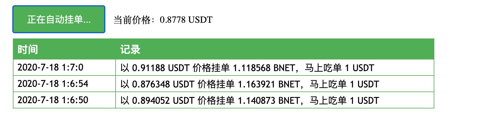

# mixprice
Mixin 钱包刷价格小工具

Mixin 钱包里币的价格除了从 coinmarketcap 上抓取，还会从 OceanONE 抓取，1 小时交易量超过 10 USDT 钱包就会显示价格，非常适合还没有上交易所的初创团队和社区交易和使用代币。

### 步骤

1、用 Mixin Messenger 登录开发者后台 https://developers.mixin.one/dashboard

2、创建一个应用（机器人），参考文章 https://developers.mixin.one/document/tutorials/dapp-guide 生成密钥

3、切换到钱包输入密钥里的信息，启用机器人的钱包功能

4、用 Mixin Messenger 找到这个机器人，给机器人充值要交易的币和 Omni USDT ，至少 10 USDT

5、点击第 4 步骤里给机器人充值要交易的币的转账记录，复制交易编号打开 https://mixin.one/snapshots 输入交易编号按回车键搜索，底部资产下面点链接，复制链接最后一串字符串待用，这串字符串就是 asset id。例如 https://mixin.one/snapshots/4d8c508b-91c5-375b-92b0-ee702ed2dac5 最后 4d8c508b-91c5-375b-92b0-ee702ed2dac5 就是 ERC20-USDT 的 asset id。

6、用文本编辑器打开上面的 html 文件，依次修改 AppPIN、AppPinToken、AppClientId、AppSessionId、AppPrivateKey，然后再修改 maxPrice 和 minPrice 这个设置最高、最低价，防止被人撸羊毛过多，最后设置 baseAssetId 为第 5 步骤取到的 asset id，然后保存

7、用 Mixin Messenger 搜索 7000101524 找到 Mixcoin 大胡子机器人，自己挂一个单，然后自己买成交一下，成交价格最好是你预期的价格（刷单价格会在最后一次挂单上下浮动）

8、用浏览器打开这个 html 文件，点开始刷价格即可，把电脑设置成不待机，24 小时开机自动刷就行，现在是每 5 分钟成交 1 USDT，1 小时能刷 10 USDT 以上

**自动刷价格有被撸羊毛的风险，尤其是有人大量抛售**

有问题通过 Mixin Messenger 私信 762532 找长老。
